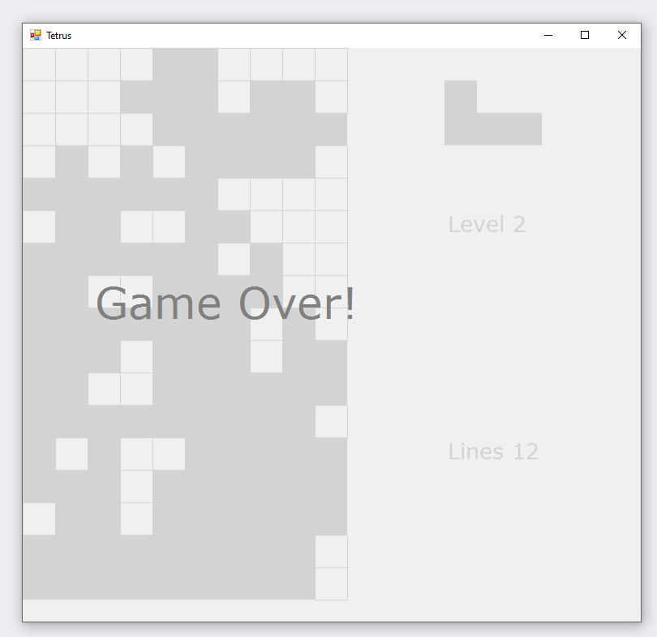

# Tetrus

### Purpose

A simple Tetris implementation for learning the features of the game.

### Prerequisites

OS: Windows XP or higher with installed .Net Framework 2.0

### Download 

The .exe version for Windows [HERE](https://github.com/x27/Tetrus/releases/latest)

### Links

https://tetris.fandom.com/wiki/Tetris_Wiki
